# 🎙️ Guaca AWS Transcription Pipeline

> **Historical Context**: Built in **Summer 2023** during the early adoption phase of generative AI in business. Originally used OpenAI's GPT-3.5 (text-davinci-003) for entity extraction - now deprecated but cutting-edge at the time.

A serverless AWS infrastructure project built with CDK for automated audio transcription and entity extraction, originally created for **Repuestos La Guaca**, a Costa Rican auto parts company that needed to process call center recordings to extract valuable business intelligence from customer interactions.

## 🏢 Business Context

**Repuestos La Guaca** needed an automated solution to:
- Process hundreds of call center audio recordings
- Extract vehicle information (make, model, year) from customer inquiries  
- Identify auto parts availability and store locations
- Store structured data for business analytics and inventory management

## 🏗️ Architecture Overview

This project implements a **serverless event-driven architecture** using AWS EventBridge and Step Functions to orchestrate a two-stage processing pipeline:

```mermaid
graph TB
    subgraph "Event-Driven Triggers"
        A[📁 S3 Bucket<br/>Audio Files] 
        B[⚡ EventBridge<br/>S3 Events]
    end
    
    subgraph "AWS Step Functions Workflow"
        C[🤖 Deepgram Lambda<br/>Speech-to-Text]
        D[🧠 OpenAI Lambda<br/>Entity Extraction] 
        E[📊 DynamoDB<br/>Store Results]
    end
    
    subgraph "External APIs"
        F[🔊 Deepgram API<br/>Spanish Transcription]
        G[🤖 OpenAI API<br/>text-davinci-003]
    end
    
    A -->|File Upload| B
    B -->|Trigger| C
    C -->|Transcript| D
    D -->|Entities| E
    
    C -.->|API Call| F
    D -.->|Entity Extraction| G
```



## 🔄 Step Functions Workflow

The processing pipeline is orchestrated by AWS Step Functions:


## 🧩 Key Components

### 🎯 **Deepgram Transcription Lambda**
- Converts Spanish audio (es-419) to text using Deepgram API
- Generates pre-signed S3 URLs for secure audio access
- Returns structured transcript with punctuation

### 🧠 **OpenAI Entity Extraction Lambda** 
- Uses GPT-3.5 (text-davinci-003) for entity extraction
- Extracts vehicle info: `{"modelo": "Corolla", "marca": "Toyota", "año": "2018"}`
- Identifies parts availability: `{"Nombre del repuesto": "Filtro de aceite", "sucursal": "Bogota Centro", "disponibilidad": "si"}`

### ⚡ **EventBridge Integration**
- S3 buckets configured with EventBridge notifications
- Event-driven architecture triggers Step Functions automatically
- Scales processing based on file upload volume

### 📊 **Data Storage**
- **DynamoDB Schema**: `Audio_key` (PK), `Transcript`, `Vehiculos[]`, `Disponibilidad[]`
- **IAM Security**: Minimal permissions, environment variables for API keys

## 🛠️ Technology Stack

| Component | Technology | Purpose |
|-----------|------------|---------|
| **Infrastructure** | AWS CDK 2.87.0 | Infrastructure as Code |
| **Orchestration** | AWS Step Functions | Workflow management |
| **Event Processing** | Amazon EventBridge | S3 event triggers |
| **Compute** | AWS Lambda (Python 3.9) | Serverless processing |
| **Storage** | Amazon S3 + DynamoDB | Audio files + structured data |
| **APIs** | Deepgram + OpenAI | Speech-to-text + entity extraction |

## 🚀 Quick Start

### Prerequisites
- AWS CLI configured
- Node.js + CDK CLI
- Python 3.9+
- API Keys: Deepgram + OpenAI

### Deploy
```bash
git clone https://github.com/adrianmf94/guaca-aws-transcription.git
cd guaca-aws-transcription
pip install -r requirements.txt

# Set environment variables
export OPENAI_API_KEY="your-key"
export DEEPGRAM_API_KEY="your-key"

# Deploy
cdk bootstrap
cdk deploy
```

### Test
```bash
# Upload Spanish audio file
aws s3 cp audio-file.mp3 s3://your-bucket-name/
```

## 📊 Sample Output

```json
{
  "Audio_key": "customer-call-20230715.mp3",
  "Transcript": "Buenos días, necesito un filtro de aceite para mi Toyota Corolla 2018...",
  "Vehiculos": [{"modelo": "Corolla", "marca": "Toyota", "año": "2018"}],
  "Disponibilidad": [{"Nombre del repuesto": "Filtro de aceite", "sucursal": "Bogota Centro", "disponibilidad": "si"}]
}
```

## 🎯 Business Impact

For **Repuestos La Guaca**:
- **⏰ Automated Processing**: 100+ daily calls processed automatically
- **📈 Data Quality**: Consistent entity extraction vs manual entry
- **🔍 Business Intelligence**: Searchable database of customer requests  
- **📊 Inventory Insights**: Track popular parts by vehicle type

## ⚠️ Important Notes

### **Technology Updates (2025)**
- `text-davinci-003`: **Deprecated** - migrate to GPT-4 or GPT-3.5-turbo
- `openai==0.27.8`: **Legacy** - update to v1.x+ SDK
- Consider [AWS Step Functions Variables](https://aws.amazon.com/about-aws/whats-new/2024/11/aws-step-functions-variables-jsonata-transformations/) and [JSONata transformations](https://aws.amazon.com/about-aws/whats-new/2024/11/aws-step-functions-variables-jsonata-transformations/) for enhanced data processing
- Explore [modern AI agents with Step Functions](https://guyernest.medium.com/building-scalable-ai-agents-with-aws-step-functions-a-practical-guide-1e4f6dd19764) patterns

### **Modernization Opportunities**
- **Function Calling**: Use OpenAI's structured outputs for reliable entity extraction
- **AWS Transcribe**: Cost-effective alternative for Spanish transcription
- **Event-Driven Scale**: EventBridge already enables reactive scaling
- **Enhanced Monitoring**: CloudWatch integration for workflow observability

## 🔮 Future Enhancements

- **Real-time Processing**: WebSocket integration for live calls
- **Multi-language Support**: Expand beyond Spanish (es-419)
- **Advanced Analytics**: ML insights on customer patterns
- **Modern AI**: Upgrade to GPT-4 with function calling

## 📄 License

MIT License - see [LICENSE](LICENSE) file for details.

---

**Built with ❤️ in Summer 2023 during the early generative AI era. A testament to the rapid evolution of AI in business applications.**
